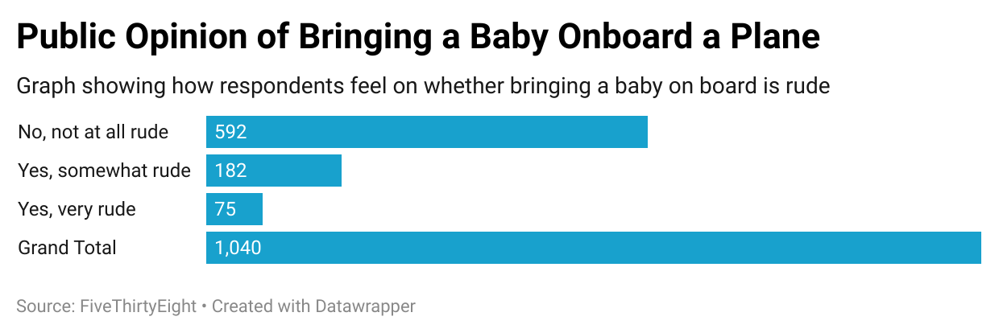

# j124-quiz4

I was drawn to the question asking about peoples' opinions on babies aboard flights as I was curious how honest people would respond.  I feel like people tend to act more passive aggressive to a crying baby while still on the plane but become more honest their potential annoyance when off the plane.  Overall, the data shows that while most respondents answered "No", a decent amount of people answered "Yes" with an even smaller proportion stating it is "very rude".  

Here is the chart I made to visulize the survey data:

